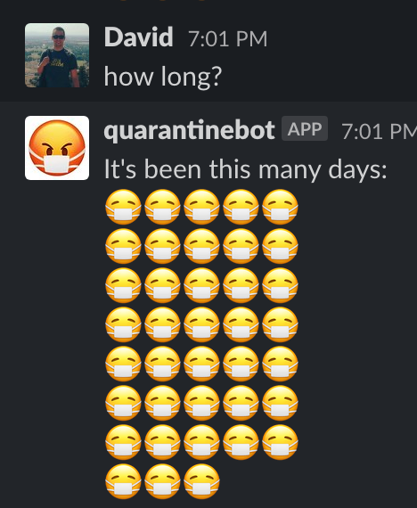

# quarantinebot

Serverless Slack bot which tells you how long you've been quarantined in units of facemasks.

* Written in Kotlin
* Built with superfast [Micronaut](https://micronaut.io/) framework
* Includes a Dockerfile for building with GraalVM for blazing-fast startup time on AWS Lambda.
* Includes Terraform configs for deploying infrastructure

# Creating a Slack bot

Create an app via https://api.slack.com/. Add it to your workspace.

## Event subscriptions

Subscribe to bot events: `app_mention`, `message.channels`, and `message.im`.

## Permissions

Add scopes for `app_mentions:read`, `im:history`, and `chat:write`.

## Bots

Enable `Always Show My Bot as Online`.

# Running tests locally

1. Do a `./gradlew build` to generate kapt annotations
2. Run tests as usual in IntelliJ

# Running application locally

Included in the build is Micronaut's Netty server.
Invoke `./gradlew run` to start it on port 8080. 
Make sure to set the `SLACK_TOKEN` environment variable to your Slack app's token.

# Compilation and deployment with GraalVM

1. Run `docker build . -t quarantinebot`
2. After build, run the container, then exit. `docker run -ti quarantinebot /bin/bash`
3. Copy the `function.zip` out of the container. `docker cp $(docker ps --last 1 --quiet):/home/application/function.zip ./`
4. On AWS Lambda, set the runtime to "Custom runtime". Use `./bootstrap` as the handler.
5. Enjoy your insanely fast lambda.

# References

* [Micronaut GraalVM tutorial](https://guides.micronaut.io/micronaut-function-graalvm-aws-lambda-gateway/guide/index.html)
* [Netty on GraalVM](https://medium.com/graalvm/instant-netty-startup-using-graalvm-native-image-generation-ed6f14ff7692)
